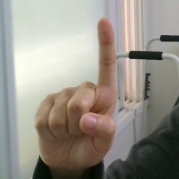

# 웹캠을 통한 가상 마우스

<p align="center">
    
</p>

## 프로젝트 소개

### 개요

* 웹캠을 통해 사용자의 손동작을 인식하여 마우스 커서 조작
* 목적
  * 마우스 또는 터치스크린 기기의 조작 방식 대체 
    * 코로나 등의 질병 전염을 줄이기 위해 키오스크 등의 터치 스크린 기기의 위생 개선
    * 실시간으로 컨텐츠 제작과 컴퓨터 조작을 동시에 수행해야하는 1인 컨텐츠 제작자들의 편의성 증진

### 흐름도

<p align="center">
    
</p>

## 사용

### 설치
```shell
# 레포지터리 클론
git clone https://github.com/boostcampaitech3/final-project-level3-cv-13.git
cd final-project-level3-cv-13

# 가상환경 생성
virtualenv virtual_mouse --python=3.8
source virtual_mouse/bin/activate

# 의존성 설치 및 플러그인 충돌 우회 (해결 중...)
pip install -r requirements.txt
mv virtual_mouse/lib/python3.8/site-packages/cv2/qt/plugins/ virtual_mouse/lib/python3.8/site-packages/cv2/qt/plugins_

# 실행
python3 main.py
```

### GUI 구성

<p align="center">
    
</p>

### 손동작 종류
|이동| 클릭                             | 우클릭                            | None                           |
|----|--------------------------------|--------------------------------|--------------------------------|
||  |  |  |

*  드래그: 클릭 상태 1초간 유지

## 모델

### 키포인트 디텍션 모델

* 

### 제스쳐 분류 모델

* 

## 팀 CV7Λ

| T3049 | T3114 | T3165 | T3209 | T3216 |
|-------|-------|-------|-------|-------|
| 김재훈| 송진우 | 이종민| 조정빈| 천영호 |

## 참고
* mmpose: https://github.com/open-mmlab/mmpose
* 손동작 분류: https://github.com/kinivi/hand-gesture-recognition-mediapipe
